

 

***

# Contents
* [The team](#the-team)
* [The challenge](#the-challenge)
* [Mobility management](#mobility-management)
  * [Platform and notors selection](#platform-selection)
  * [Chassis design](#weight-distribution)
    * [Models](https://github.com/XLNC-Deoxys/WRO-FE25/tree/main/Models)
  * [BOM and assembly instructions](#components-and-building-instructions)
    * [Bill of materials](https://github.com/XLNC-Deoxys/WRO-FE25/tree/main/Bill_of_materials.pdf)
    * [Instruction](https://github.com/XLNC-Deoxys/WRO-FE25/tree/main/Instruction.pdf)
* [Power and sense management](#power-and-sense-management)
  * [Microcontroller selection](#microcontroller-selection)
  * [Sensor management](#sensor-management)
    * [Ultrasonic research](https://github.com/XLNC-Deoxys/WRO-FE25/blob/main/Ultrasonic_research/README.md) 
  * [Power management](#power-management)
    * [Schemes](https://github.com/XLNC-Deoxys/WRO-FE25/tree/main/Scheme.pdf)
* [Software](#software)
  * [Open challenge](#open-challenge)
    * [Performance video]()
    * [Open program exlanation](https://github.com/XLNC-Deoxys/WRO-FE25/blob/main/Source/Open_Explanation.md)
    * [Open program pseudocode](#pseudocode)
  * [Obstacle challenge](#obstacle-challenge)
    * [Performance video]()
    * [Ostacle program explanation](https://github.com/XLNC-Deoxys/WRO-FE25/blob/main/Source/Obstacle_Explanation.md)
    * [Obstacle program pseudocode](#pseudocode)
  * [Calibration program exlanation](https://github.com/XLNC-Deoxys/WRO-FE25/blob/main/Source/Calibration_Explanation.md)
* [Future plans](#future-plans)
* [Robot photos](#robot-photos)

***

# The team

We are the XLNC-Deoxys team from Kazakhstan, and we are competing in the 2025 WRO Future Engineers category.

| 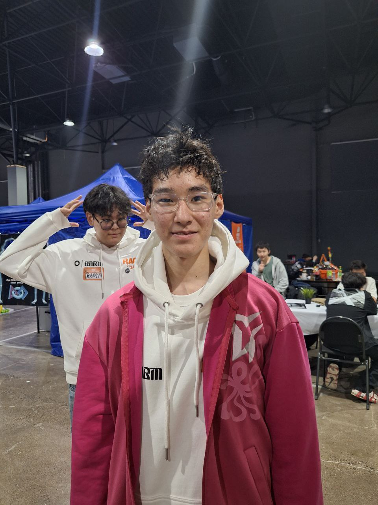 | 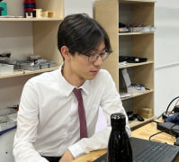 |
| ---| -- |
| **Dastan Musrepov** | **Zhanibek Danabek** |
| Builder | Programmer |

# The challenge

The **[WRO 2024 Future Engineers - Self-Driving Cars](https://wro-association.org/)** challenges participants to design, build, and program an autonomous, self-driving car capable of stable navigation on a constantly changing game track. The challenge includes two tasks: driving around a circuit with changing interior walls and avoiding randomly placed obstacles based on their color, and performing a precise parallel parking maneuver at the end. Teams must utilize complex robotic systems, such as computer vision, sensor fusion, and kinematics, focusing on stability and innovation.

This challenge addresses all aspects of the engineering process, including:
**Mobility Management**: Designing efficient vehicle propulsion mechanisms.
**Obstacle Avoidance**: Developing a strategy for detecting and navigating road signs (red and green markers) within specified rules.
**Documentation**: Demonstrating engineering progress, design solutions, and open-source collaboration through a publicly accessible GitHub repository.

A link to the rules can be found [here](https://wro-association.org/wp-content/uploads/WRO-2024-Future-Engineers-Self-Driving-Cars-General-Rules.pdf).

# Mobility management

## Robot photos

 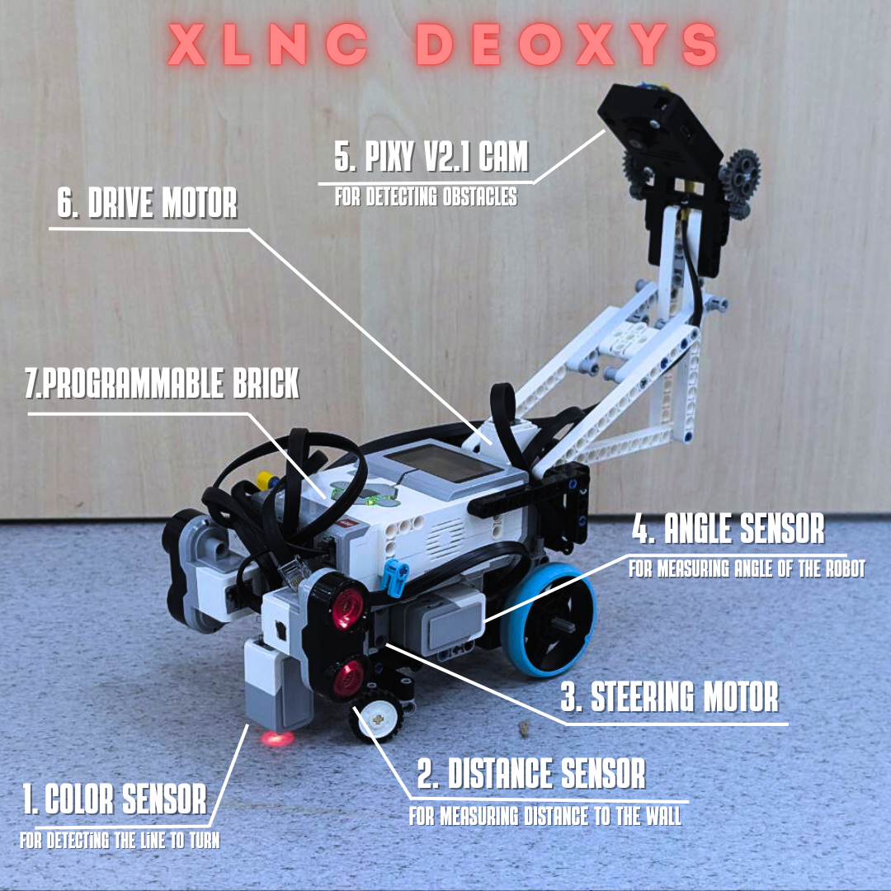

## Platform selection

We used LEGO to build the robot because they allow for rapid design and testing of mechanical and electronic solutions, ensuring stable motors, sensors, and compatibility with official controllers. This reduces assembly time and allows us to focus on autonomous driving algorithms rather than complex mechanics.

## Motor selection

| Motor | Nominal Speed (RPM) | Running Torque (N·cm) | Stall Torque (N·cm) | Mass (g) | Power Consumption (W) |
| -- | -- | -- | -- | -- | --|
| EV3 Medium Motor | 250 | 8 | 12 | 75 | 2.5 |
| EV3 Large Motor | 160 | 20 | 40 | 110 | 4.0 |

We chose medium Lego motors for the drive and steering because they have an encoder and sufficient torque, and compared to large Lego motors, medium motors are lighter, more compact, and more accurate.

## Weight distribution
We shifted the center of gravity to the front axle by mounting the steering motor horizontally and placing the main weight of the robot—the programmable brick (311 g of 650 g)—directly above the front axle. This increased friction on the front wheels, and the turning radius was reduced by almost half compared to our first design. This robot has a high center of gravity, but this doesn't hinder it since it moves slowly. (дополнить цифрами)

## Chassis design

  
  &nbsp; ➡️ &nbsp;
  
  &nbsp; ➡️ &nbsp;
  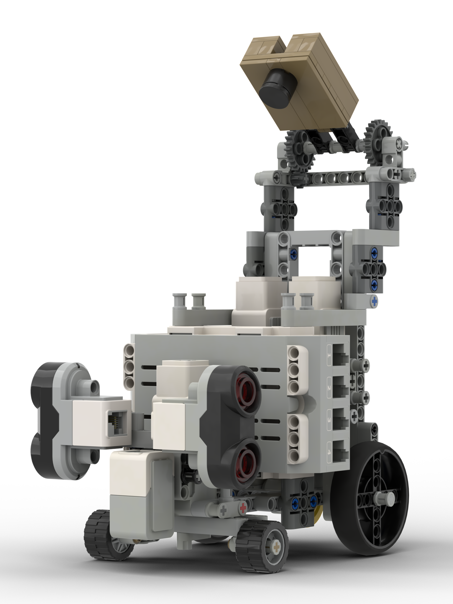

The main idea behind our design was simplicity.

 
 

We use a LEGO differential (a new reinforced one because it does not slip and can withstand any loads) to prevent wheel slippage when turning. The operating principle of the differential is shown in the photo above.

Our robot's base consists of just two main beams, supporting both motors, the differential, the rear wheels, the steering gear, the brake, and the gyroscope. This is the simplest and lightest design, weighing only 500 grams. We believed that using printed parts would increase friction between the moving parts, complicate the design, and increase the weight of the robot.

We selected the diameter of the wheels so that the robot's design would be as simple as possible and the robot would be perpendicular to the ground for the correctness of the gyroscope value.

We tried to make the base as short as possible to reduce the turning radius. However, this resulted in a significantly increased front overhang (6 cm) compared to our previous robot (1 cm). Our robot's dimensions are 29 x 9 x 26.5 cm. This means we utilize the full permitted length and height.

## Ackerman steering geometry

|  | 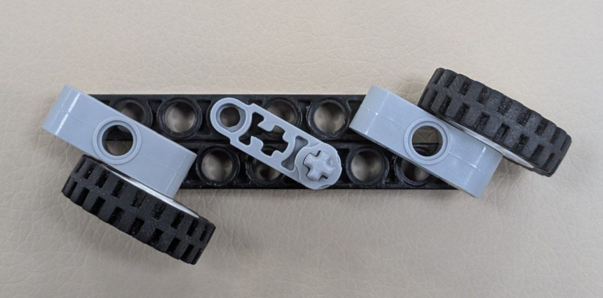 |
| :---: | :---: |
| **Ackerman steering** | **Parallel steering** |

After extensive testing of the Ackerman steering geometry, we decided to go with parallel steering, as the Ackerman steering design significantly reduces the maximum steering angle of the wheels, and the play in the LEGO parts makes it less precise, especially in the micro-movements we use constantly throughout the program. One of the reasons for the ineffectiveness of the Ackerman steering system in our case is the size, weight, and speed of the robot. At such a small scale, the absence of a steering system is not critical, as both systems will behave identically.

To compensate for the lack of an Ackermann system and enable a maximum turning angle of up to 70 degrees without bouncing or abrupt movements, we installed thin wheels on the front axle. When turning at such a large angle, they slide slightly on the surface, allowing for a significantly smaller turning radius without sacrificing smoothness, precision, or compactness.

## Camera Positioning

We moved the camera as far back as possible (by 17.6 cm from the center) and upward (by 27 cm from the ground) for a better view and to keep obstacles in sight for a long time. This also lengthens the robot and, consequently, the parking area.

 
 

The camera mount is designed to be as light and sturdy as possible, as otherwise the camera will wobble and the robot will move crookedly. The lever created by the huge distance between the base and the camera will put pressure on the rear axle, impairing maneuverability. To achieve these goals, we used the Pythagorean theorem in beam connections (8, 15, 17). Our camera mount allows for quick adjustment of its angle.

## Old designs

 
 

At the regional and national stages, we also used the EV3, but we tried to build the shortest and fastest robot possible for parking and rapid qualification. It was shorter by 12 cm but wider by 6 cm.

| Advantages | shorter | lower center of gravity | easier battery changes |
| -- | -- | -- | -- |
| Disadvantages | wider | less accurate odometry |  | 

 
 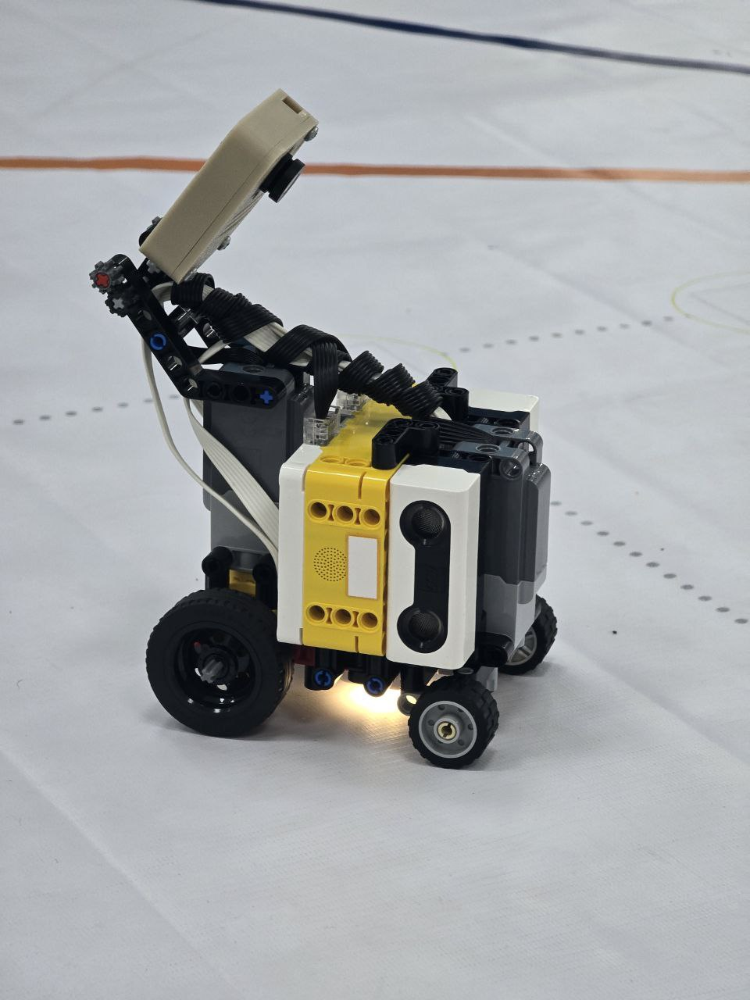

Then, during training camp, we switched to a new platform – the LEGO Spike Prime. It turned out to be the smallest we've ever built: approximately 10 x 10 cm. Our camera protruded 15 cm back, which made parking incredibly easy, but due to the ban on parking simplifications by driving over it, this compact design was pointless. For this design, we used the OpenMV H7 Plus camera, which, as it turned out, has a small field of view. Therefore, we had to use crutches and pinpoint the exact position of the obstacle using a SLAM unit.

| Advantages | smallest (fits in a pocket) | large number of iterations thanks to a powerful brick and pybricks | smallest turning radius |
| -- | -- | -- | -- |
| Disadvantages | doesn't comply with new regulations | camera field of view is too small | |

 
 

## Components and building instructions

We used parts from the standard EV3 and Spike Prime kits (дополнииить), as well as a Pixy2 camera, which can be ordered ([here](https://www.dfrobot.com/product-1752.html)), a 3D model of which, along with a printed case, can be found [here](https://github.com/XLNC-Deoxys/WRO-FE25/tree/main/Models). You can find our bill of materials [here](https://github.com/XLNC-Deoxys/WRO-FE25/tree/main/Bill_of_materials.pdf). You can find the assembly instructions [here](https://github.com/XLNC-Deoxys/WRO-FE25/tree/main/Instruction.pdf).

***

# Power and sense management

## Microcontroller selection

We chose EV3 as a main microcontroller because:

1) LEGO Mindstorms EV3 has official sensors whose quality and reliability we're confident in, as well as sensors and modules from third-party manufacturers (such as Pixie) that support LEGO Mindstorms EV3 without any additional workarounds.
2) Unlike the 3D-printed parts found in robots using Arduino and Raspberry Pi, LEGO construction can be quickly and easily changed.

| --- |  |  |  |  |  |
| -- | -- | -- | -- | -- | -- |
| Parameter | **LEGO EV3** | **LEGO SPIKE Prime** | **Raspberry Pi 5** | **Arduino Uno R3** | **NVIDIA Jetson Nano** |
| **Processor / MCU** | ARM9 300 MHz | ARM Cortex-A7 528 MHz | Broadcom BCM2712 (4 × Cortex-A76 2.4 GHz) | ATmega328P (8-bit 16 MHz) | Quad-core ARM A57 1.43 GHz + GPU 128 CUDA |
| **RAM** | 64 MB | 64 MB | 4–8 GB | 2 KB | 4 GB |
| **Storage / SD Card** | microSD up to 32 GB | Built-in + microSD | microSD or SSD M.2 | None | microSD up to 128 GB |
| **I/O Interfaces** | 4 motor ports / 4 sensor ports | 6 universal ports | 40 GPIO | 14 GPIO | 40 GPIO |
| **Sensor / Module Support** | LEGO EV3 / NXT sensors / PixyCam2 | LEGO SPIKE / Powered Up sensors | Any (Cameras, IMU, LiDAR, GPS etc.) | Analog / digital basic sensors | Cameras, LiDAR, IMU, AI modules |
| **Computer Vision Support** | No (limited) | No (limited) | Yes (OpenCV, TensorFlow Lite, AI models) | No | Yes (OpenCV, PyTorch, TensorRT) |
| **Programming Languages** | EV3-G, Basic (CLEV3R) | Scratch, Python (Pybricks) | Python, C++, ROS, OpenCV | C/C++ (Arduino IDE) | Python, C++, CUDA, ROS |
| **Development Complexity** | Low | Low | Medium-High | Low | High |
| **Approx. Price** | ≈ 250 USD | ≈ 400 USD | ≈ 150 USD | ≈ 25 USD | ≈ 250 USD |
| **Power Supply** | EV3 battery | SPIKE battery | USB-C 5V 5A | 9V / USB | 5V 4A |
| **Advantages** | Easy to use, reliable, ready-made sensors | Quick assembly, modern interface, BLE | Full computer, AI capabilities, OpenCV | Very cheap and simple | High performance, neural network processing, GPU |
| **Disadvantages** | Limited speed and memory | Limited custom library support | Requires setup and cooling | No storage, very low power | High power consumption, requires cooling |

## Sensor management

We use sensors for more stable driving. We use an EV3 color sensor to detect lines and determine their color, an EV3 gyroscope for precise 90-degree turns, and an EV3 ultrasonic sensor to maintain distance to the wall and detect parking. On Qualification, we have two sensors facing in different directions, and on the Obstacle Challenge, we use a single ultrasonic sensor due to a lack of ports.

To determine the most accurate distance the robot can get from a boundary, we conducted a study, which you can read in the [Researches](https://github.com/RobotekPRIME2024/WRO-FE24/tree/main/Ultrasonic_research) folder. The ultrasonic sensor provides inaccurate data if it's positioned at an angle. On April 8th, we plotted a graph showing the error as a function of angle. To more accurately determine the distance to the wall, we use the ultrasonic sensor's readings using the formula... (I can't remember whether it's cosine or sine). We tested a scanning ultrasonic sensor system, but found that it greatly complicates the code and makes the robot larger, but doesn't provide much benefit compared to a conventional distance sensor.

For maximum stability, the EV3 gyroscope and EV3 ultrasonic sensor complement each other, preventing the car from crashing into a wall even if one of them begins to show errors.

The motor encoders and gyroscope allow us to use odometry, which we enable during parking to prevent it from accumulating errors and since we don't need it for obstacle avoidance.

### EV3 Gyro Sensor
<table><tr>
<td style="vertical-align:top; width:260px;">
  
</td>
<td style="vertical-align:top;">

<strong>Function:</strong> Measures heading and turns for accurate angle tracking.

<strong>Range:</strong> ±440 °/s.

<strong>Accuracy:</strong> ±3 °.

<strong>Outputs:</strong> Angle (°) and Rate (°/s).

<strong>Protocol:</strong> UART.

</td></tr></table>

### EV3 Color Sensor
<table><tr>
<td style="vertical-align:top; width:260px;">
  
</td>
<td style="vertical-align:top;">

<strong>Function:</strong> Detects lines and classifies surface colors for reliable navigation.

<strong>Modes:</strong> Color (8 colors), Reflected Light, Ambient Light.

<strong>Range:</strong> 0–100 % light intensity, effective up to ~1 cm.

<strong>Protocol:</strong> UART.

</td></tr></table>

### EV3 Ultrasonic Sensor
<table><tr>
<td style="vertical-align:top; width:260px;">
  
</td>
<td style="vertical-align:top;">

<strong>Function:</strong> Measures wall distance, enables centering and detecting the parking zone.

<strong>Range:</strong> 3 cm – 250 cm.

<strong>Accuracy:</strong> ±1 cm.

<strong>Protocol:</strong> UART.

</td></tr></table>

### PixyCam 2.1 LEGO Edition
<table><tr>
<td style="vertical-align:top; width:260px;">
  
</td>
<td style="vertical-align:top;">

<strong>Function:</strong> Detects red/green obstacles for color + position-based path planning.

<strong>Processor:</strong> NXP LPC4330, dual-core ARM Cortex-M4 @ 204 MHz.

<strong>Image Sensor:</strong> Omnivision OV9282 (1/4″ CMOS Global Shutter).

<strong>Resolution:</strong> 640 × 400 pixels.

<strong>Frame Rate:</strong> Up to 60 frames per second.

<strong>Lens FOV:</strong> 60° horizontal × 40° vertical.

<strong>Protocol:</strong> I2C.

<strong>Recognition Modes:</strong> Color Signature Tracking (up to 7), Line / Intersection Detection, Barcode / Arrow Detection.

<strong>LEGO Compatibility:</strong> Direct plug-and-play with LEGO EV3.

<strong>Lighting:</strong> Integrated RGB LED for auto exposure feedback.

<strong>Power Supply:</strong> 5 V @ 150 mA (via LEGO port or USB).

<strong>Dimensions:</strong> 50 × 40 × 36 mm.

<strong>Weight:</strong> &lt; 30 g.

</td></tr></table>

## Power management
We used the rechargeable lithium-ion battery included with the LEGO Mindstorms EV3 as a power source. Although regular AA batteries hold a charge longer, they cannot be recharged, which is critical during competitions. Before each launch, we check that the battery is fully charged, and we have an extra full battery in reserve.

***

# Software

## Open challenge

To help you better understand what I'm explaining, you can [click here](https://youtu.be/qQTfzTyW7DM) to view the video we created.

  

Our team has decided to employ a simple strategy for completing the "open" round. The driving system itself uses a combination of the onboard gyroscope and ultrasonic sensor. The ultrasonic sensor measures the distance to the outer/inner wall and the robot attempts to maintain a certain distance (stored in a variable) from that wall. The gyroscope allows it to maintain a straight trajectory forward with minimum deviation. During the very first turn of the round, our robot scans the first line it passes over using a colour sensor and stores its value in a variable. This one-time operation tells our program if the robot is going clockwise or counter-clockwise (orange for clockwise and blue for counter-clockwise). This information then affects all the turns going forward, deciding whether the robot turns left or right by changing the desired turn angle to negative or vice-versa. Those turns are executed by changing the desired angle to 90 or -90 in our gyroscope function. The robot also uses a variable as a counter to check how many lines it has passed. Once that variable is equal to 12 (which means that all 3 laps are finished) the robot drives forward for a set period of time to land in its starting area and stops.

### Pseudocode

https://github.com/XLNC-Deoxys/WRO-FE25/blob/4a5e3cee411c91461a604e7479d26907a3826eb7/Source/Pseudocode.py#L1-L52

### Flowchart

## Obstacle challenge

### Pixy2

We use a Pixy2 camera to detect obstacles and determine their color. This camera is designed specifically for use with LEGO Mindstorms EV3, so it's very easy to connect and get started. We use ([Pixymon](https://github.com/charmedlabs/pixy2/raw/master/releases/pixymon_windows/pixymon_v2_windows-3.0.24.exe)) to configure the camera. A guide on setting up the camera can be found ([here](https://docs.pixycam.com/wiki/doku.php?id=wiki:v2:teach_pixy_an_object_2)).
1) First, we simply drive past the obstacle and record its coordinates from the camera.
2) Then we transfer these values ​​to Google Sheets and find the best fit line. Our sheet with the function calculation can be found [here](https://docs.google.com/spreadsheets/d/1uQ3p7Dw0eju2VstwOmTVAWoVSMLZkzuku79VgqmB5RI).
3) Then we insert it into the code and write the logic so that the robot tries to drive so that the obstacle's coordinates from the camera match the graph.

### Strategy

To help you better understand what I'm explaining, you can [click here](https://youtu.be/qQTfzTyW7DM) to view the video we created.

  

While there is no obstacle in the camera's field of view, our robot behaves similarly to the qualification run: maintaining a constant distance from the wall using an ultrasonic sensor and staying on track as well as making turns using a gyroscope.
As soon as an obstacle enters the camera's field of view, the robot switches to detour mode. For detouring, we have created a predefined function in the form of kx+b with carefully calibrated coefficients. This line acts as the ideal path that the center of the detected obstacle needs to follow in the image frame. In short, we define where the obstacle should "appear" on the camera as the robot moves in a ideal situation.
Using our "detour line" and the obstacle's XY position in the image frame, our robot can calculate the deviation of the obstacle from the ideal path and adjust its steering accordingly. This method provides our robot with consistency and ease of modification, due to the fact that every detour is mathematically identical and the coefficients of our ideal path can be changed with little effort to adapt to various situations.

#### Parking

Once our robot has completed the required 3 laps, we integrate odometry into its movement system. After the last turn, we slow down movement and drive until the ultrasonic sensor detects the "left" wall of the parking zone. During this drive, the same principle as in the qualification rounds applies, the robot attempts to stay within a certain distance from the outer wall). As soon as the parking zone's wall is detected, the robot drives forward slightly before performing a predefined set of odometry maneuvers that land it safely inside the parking zone.
As you may have deduced, the above explanation only applies to counter-clockwise movement, as our primary ultrasonic sensor is located to the right of the robot and without it the detection of the parking zone is impossible. The solution to this, however, is simple. When driving clockwise, after finishing the final lap, the robot drives forward and performs a U-Turn, resulting in its position and direction being similar to its position during the beginning of our counter-clockwise parking algorithm (with negligible deviation). Once the U-Turn is performed, the robot applies that same counter-clockwise parking algorithm.

***

# To be improved

## New microcontroller (Raspberry Pi)

Despite its simplicity, using LEGO poses many limitations:
1) Number of ports: The EV3 brick only has 4 sensor ports and 4 motor ports, so this year we only had to install one ultrasonic sensor for the obstakl.
2) Size and weight: The LEGO Mindstorms EV3 brick is almost half the weight of our robot (311 of 670 g). All the sensors and motors for LEGO are very large.
3) Сomputing power: The Raspberry Pi has a 5x higher frequency and 4 cores than the LEGO EV3. This allows for more iterations in odometry.
4) Compatibility: Unfortunately, the sensors and cameras compatible with LEGO are far from the best. The Raspberry Pi is much more flexible in this regard, as you can connect anything to it. This allows us to use the most accurate and fastest sensors and cameras.

## 3D printed parts

Our robot is made entirely of LEGO pieces, but the downside of moving parts made of Lego is that they weren't designed for precision mechanisms. The motor axles, gears, and differential are made of Lego and have some play. By eliminating this, we can greatly improve the precision of the steering mechanism and drive. Printed parts also make the structure more robust.

## Odometry
Our team has also experimented thoroughly with odometry. One version of our program (the SPIKE version) used a full odometry system to complete both the obstacle and open runs. Initially, we explored it because it would make adapting to surprise rules easier, however, the error propagation caused instability in later laps, which is why we decided to abandon it. We are currently attempting to integrate odometry into our parking algorithm to enhance precision and prevent wall-bumps.

***

# Robot photos

  <table>
    <tr align="center">
      <td>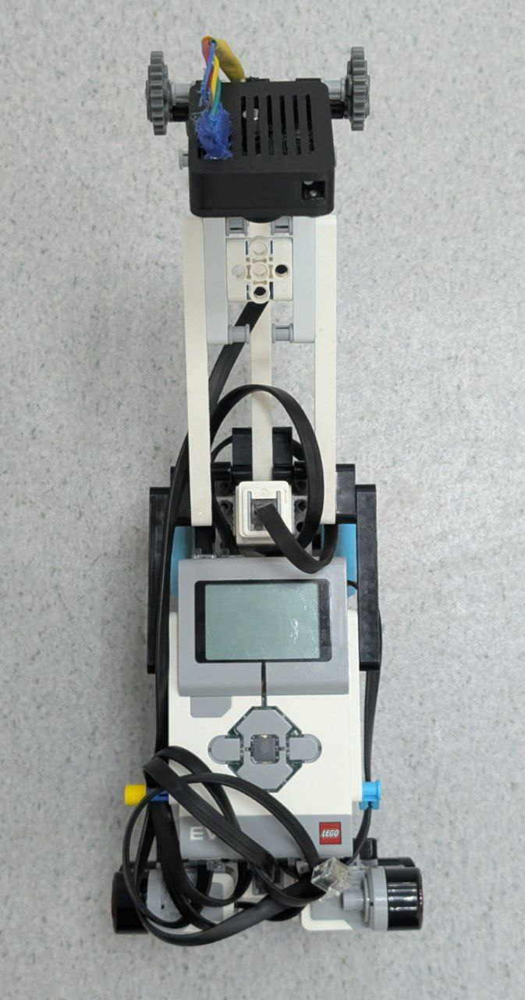</td>
      <td>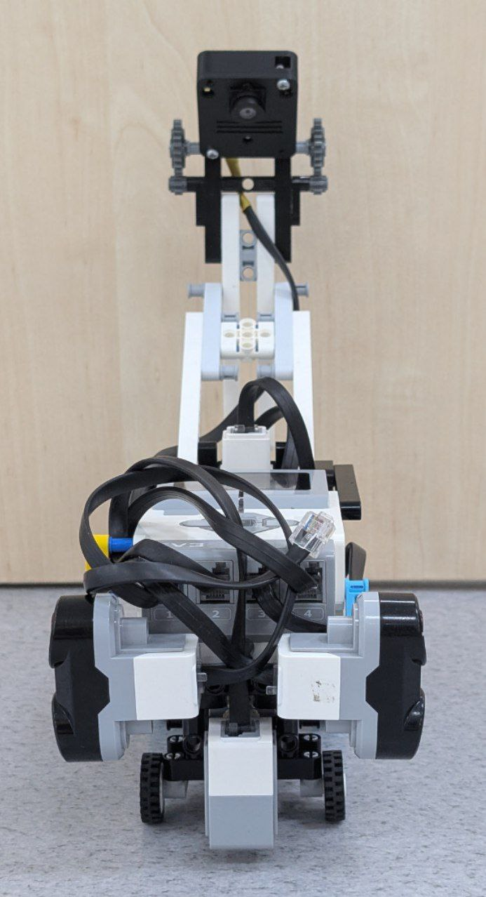</td>
      <td>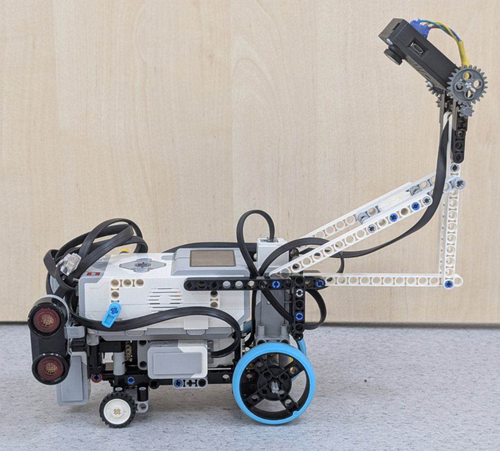</td>
    </tr>
    <tr align="center">
      <td>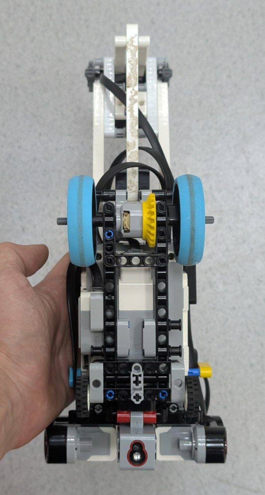</td>
      <td>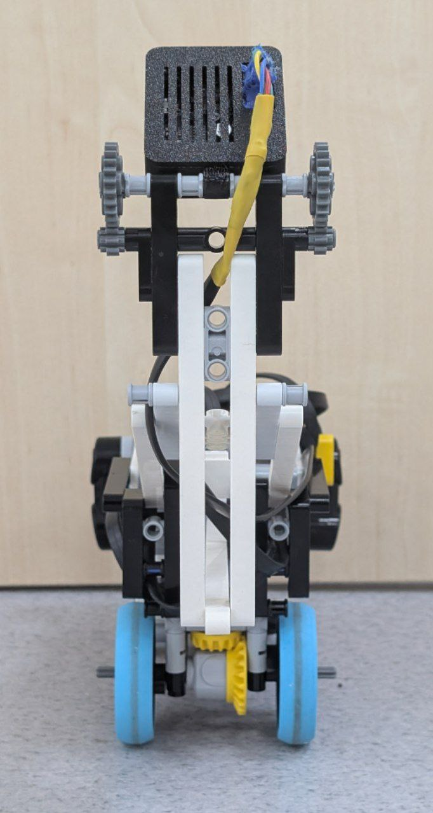</td>
      <td>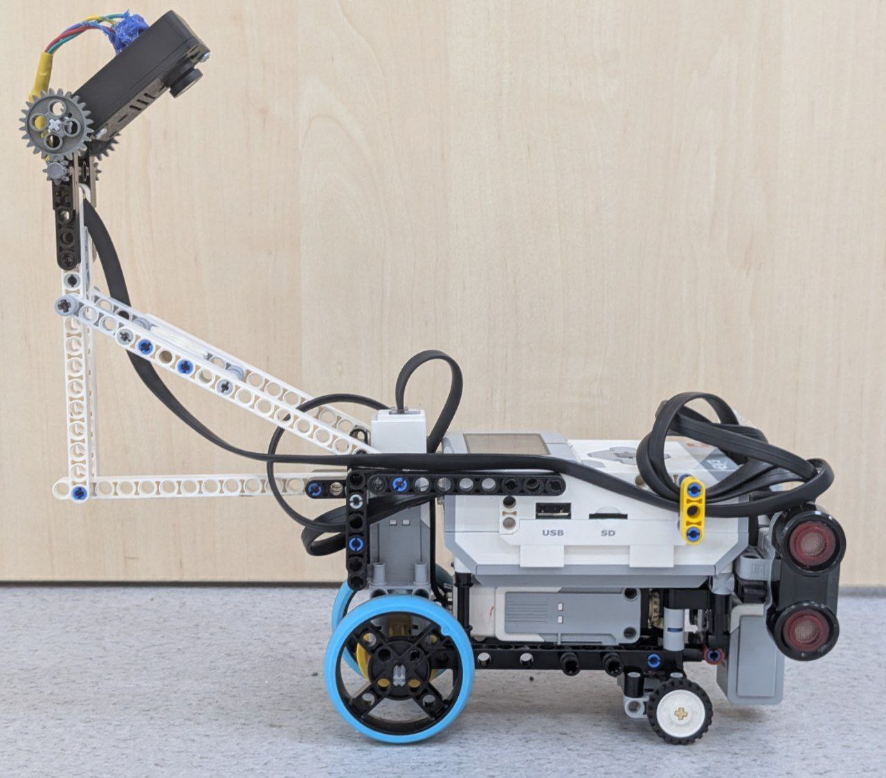</td>
    </tr>
  </table>

  <li>You can see a photos of the robot <a href="https://github.com/XLNC-Deoxys/WRO-FE25/tree/main/Images/Robot_photos" target="_blank">here</a></li>
