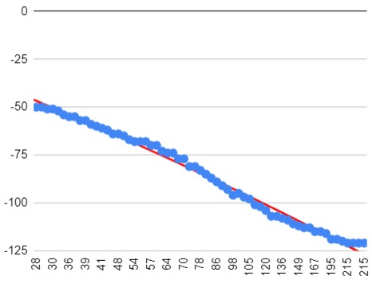
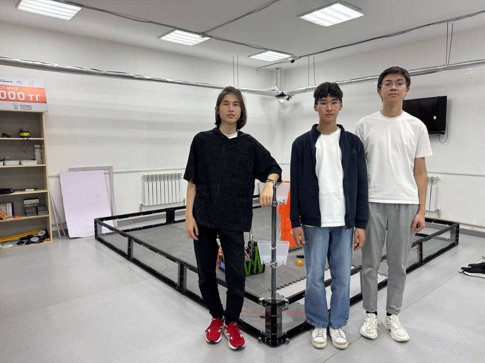
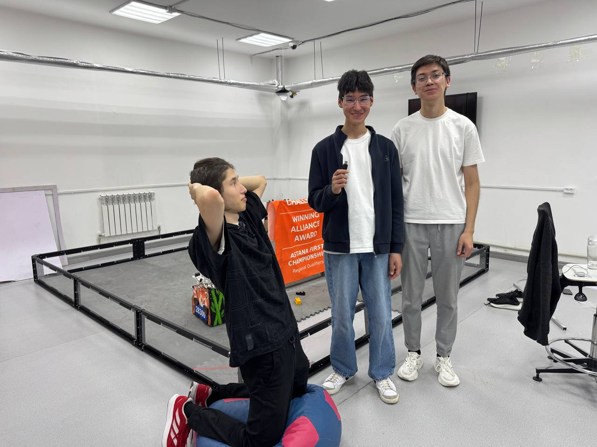

 

***

# Contents
* [The team](#the-team)
* [The challenge](#the-challenge)
* [Mobility management](#mobility-management)
  * [Platform and notors selection](#platform-selection)
  * [Chassis design](#weight-distribution)
    * [Models](https://github.com/XLNC-Deoxys/WRO-FE25/tree/main/Models)
  * [BOM and assembly instructions](#components-and-building-instructions)
    * [Bill of materials](https://github.com/XLNC-Deoxys/WRO-FE25/tree/main/Bill_of_materials.pdf)
    * [Instruction](https://github.com/XLNC-Deoxys/WRO-FE25/tree/main/Instruction.pdf)
* [Power and sense management](#power-and-sense-management)
  * [Power management](#power-management)
    * [Schemes](https://github.com/XLNC-Deoxys/WRO-FE25/tree/main/Scheme.pdf)
  * [Sensor management](#sensor-management)
    * [Ultrasonic research](https://github.com/XLNC-Deoxys/WRO-FE25/blob/main/Ultrasonic_research/README.md) 
* [Obstacle management](#obstacle-management)
  * [Obstacle program exlanation](https://github.com/XLNC-Deoxys/WRO-FE25/blob/main/Source/Obstacle_Explanation.md)
  * [Open program exlanation](https://github.com/XLNC-Deoxys/WRO-FE25/blob/main/Source/Open_Explanation.md)
  * [Calibration program exlanation](https://github.com/XLNC-Deoxys/WRO-FE25/blob/main/Source/Calibration_Explanation.md)
  * [Pseudocode](https://github.com/XLNC-Deoxys/WRO-FE25/blob/main/Source/Pseudocode.py)
* [Performance video](#performance-video)
  * [Qualification](https://youtu.be/nNbZ0sVMQO8?si=B9W68_eUjR0Os-pi)
  * [Obstacle](https://youtu.be/7eHMRto1uII?si=gZwUpWQbs9ktGe9v)
* [Pictures](#pictures)
  * [Team photos](#team-photos)
  * [Robot photos](#robot-photos)

***

# The team

We are the XLNC-Deoxys team from Kazakhstan, and we are competing in the 2025 WRO Future Engineers category.

|  |  |
| ---| -- |
| **Dastan Musrepov** | **Zhanibek Danabek** |
| Builder | Programmer |

# The challenge

The **[WRO 2024 Future Engineers - Self-Driving Cars](https://wro-association.org/)** challenges participants to design, build, and program an autonomous, self-driving car capable of stable navigation on a constantly changing game track. The challenge includes two tasks: driving around a circuit with changing interior walls and avoiding randomly placed obstacles based on their color, and performing a precise parallel parking maneuver at the end. Teams must utilize complex robotic systems, such as computer vision, sensor fusion, and kinematics, focusing on stability and innovation.

This challenge addresses all aspects of the engineering process, including:
**Mobility Management**: Designing efficient vehicle propulsion mechanisms.
**Obstacle Avoidance**: Developing a strategy for detecting and navigating road signs (red and green markers) within specified rules.
**Documentation**: Demonstrating engineering progress, design solutions, and open-source collaboration through a publicly accessible GitHub repository.

A link to the rules can be found [here](https://wro-association.org/wp-content/uploads/WRO-2024-Future-Engineers-Self-Driving-Cars-General-Rules.pdf).

# Mobility management

## Robot photos

 

## Platform selection

We used LEGO to build the robot because they allow for rapid design and testing of mechanical and electronic solutions, ensuring stable motors, sensors, and compatibility with official controllers. This reduces assembly time and allows us to focus on autonomous driving algorithms rather than complex mechanics.

## Motor selection

| Motor | Nominal Speed (RPM) | Running Torque (N·cm) | Stall Torque (N·cm) | Mass (g) | Power Consumption (W) |
| -- | -- | -- | -- | -- | --|
| EV3 Medium Motor | 250 | 8 | 12 | 75 | 2.5 |
| EV3 Large Motor | 160 | 20 | 40 | 110 | 4.0 |

We chose medium Lego motors for the drive and steering because they have an encoder and sufficient torque, and compared to large Lego motors, medium motors are lighter, more compact, and more accurate.

## Weight distribution
We shifted the center of gravity to the front axle by mounting the steering motor horizontally and placing the main weight of the robot—the programmable brick (311 g of 650 g)—directly above the front axle. This increased friction on the front wheels, and the turning radius was reduced by almost half compared to our first design. This robot has a high center of gravity, but this doesn't hinder it since it moves slowly. (дополнить цифрами)

## Chassis design

  
  &nbsp;➡️&nbsp;
  
  &nbsp;➡️&nbsp;
  

The main idea behind our design was simplicity.

We use a Lego differential (a new reinforced one because it does not slip and can withstand any loads) to prevent wheel slippage when turning. Our robot's base consists of just two main beams, supporting both motors, the differential, the rear wheels, the steering gear, the brake, and the gyroscope. This is the simplest and lightest design, weighing only 500 grams. We believed that using printed parts would increase friction between the moving parts, complicate the design, and increase the weight of the robot.

We selected the diameter of the wheels so that the robot's design would be as simple as possible and the robot would be perpendicular to the ground for the correctness of the gyroscope value.

We tried to make the base as short as possible to reduce the turning radius. However, this resulted in a significantly increased front overhang (6 cm) compared to our previous robot (1 cm). Our robot's dimensions are 29 x 9 x 26.5 cm. This means we utilize the full permitted length and height.

## Ackerman steering geometry

|  |  |
| :---: | :---: |
| **Ackerman steering** | **Parallel steering** |

After extensive testing of the Ackerman steering geometry, we decided to go with parallel steering, as the Ackerman steering design significantly reduces the maximum steering angle of the wheels, and the play in the LEGO parts makes it less precise, especially in the micro-movements we use constantly throughout the program. One of the reasons for the ineffectiveness of the Ackerman steering system in our case is the size, weight, and speed of the robot. At such a small scale, the absence of a steering system is not critical, as both systems will behave identically.

To compensate for the lack of an Ackermann system and enable a maximum turning angle of up to 70 degrees without bouncing or abrupt movements, we installed thin wheels on the front axle. When turning at such a large angle, they slide slightly on the surface, allowing for a significantly smaller turning radius without sacrificing smoothness, precision, or compactness.

## Camera Positioning

We moved the camera as far back as possible (by 17.6 cm from the center) and upward (by 27 cm from the ground) for a better view and to keep obstacles in sight for a long time. This also lengthens the robot and, consequently, the parking area.

 
 

The camera mount is designed to be as light and sturdy as possible, as otherwise the camera will wobble and the robot will move crookedly. The lever created by the huge distance between the base and the camera will put pressure on the rear axle, impairing maneuverability. To achieve these goals, we used the Pythagorean theorem in beam connections (8, 15, 17). Our camera mount allows for quick adjustment of its angle.

## Old designs

 
 

At the regional and national stages, we also used the EV3, but we tried to build the shortest and fastest robot possible for parking and rapid qualification. It was shorter by 12 cm but wider by 6 cm.

| Pros | shorter | lower center of gravity | easier battery changes |
| -- | -- | -- | -- |
| Cons | wider | less accurate odometry |  | 

 
 

Then, during training camp, we switched to a new platform – the LEGO Spike Prime. It turned out to be the smallest we've ever built: approximately 10 x 10 cm. Our camera protruded 15 cm back, which made parking incredibly easy, but due to the ban on parking simplifications by driving over it, this compact design was pointless. For this design, we used the OpenMV H7 Plus camera, which, as it turned out, has a small field of view. Therefore, we had to use crutches and pinpoint the exact position of the obstacle using a SLAM unit.

| Pros | smallest (fits in a pocket) | large number of iterations thanks to a powerful brick and pybricks | smallest turning radius |
| -- | -- | -- | -- |
| Cons | doesn't comply with new regulations | camera field of view is too small | |

## Components and building instructions

We used parts from the standard EV3 and Spike Prime kits (дополнииить), as well as a Pixy2 camera, which can be ordered ([here](https://www.dfrobot.com/product-1752.html)), a 3D model of which, along with a printed case, can be found [here](https://github.com/XLNC-Deoxys/WRO-FE25/tree/main/Models). You can find our bill of materials [here](https://github.com/XLNC-Deoxys/WRO-FE25/tree/main/Bill_of_materials.pdf). You can find the assembly instructions [here](https://github.com/XLNC-Deoxys/WRO-FE25/tree/main/Instruction.pdf).

***

# Power and sense management

## Power management

The power for the EV3 Brick and the whole vehicle comes from a rechargeable 10V Lithium Battery. It (with a brick) is placed closer to the front axle than to the rear to ensure good traction of the front wheels when cornering. Schemes for each electronic part of the robot can be found [here](https://github.com/XLNC-Deoxys/WRO-FE25/tree/main/Scheme.pdf).

## Sensor management

We use sensors for more stable driving. We use an EV3 color sensor to detect lines and determine their color, an EV3 gyroscope for precise 90-degree turns, and an EV3 ultrasonic sensor to maintain distance to the wall and detect parking. On Qualification, we have two sensors facing in different directions, and on the Obstacle Challenge, we use a single ultrasonic sensor due to a lack of ports.

To determine the most accurate distance the robot can get from a boundary, we conducted a study, which you can read in the [Researches](https://github.com/RobotekPRIME2024/WRO-FE24/tree/main/Ultrasonic_research) folder. The ultrasonic sensor provides inaccurate data if it's positioned at an angle. On April 8th, we plotted a graph showing the error as a function of angle. To more accurately determine the distance to the wall, we use the ultrasonic sensor's readings using the formula... (I can't remember whether it's cosine or sine). We tested a scanning ultrasonic sensor system, but found that it greatly complicates the code and makes the robot larger, but doesn't provide much benefit compared to a conventional distance sensor.

For maximum stability, the EV3 gyroscope and EV3 ultrasonic sensor complement each other, preventing the car from crashing into a wall even if one of them begins to show errors.

The motor encoders and gyroscope allow us to use odometry, which we enable during parking to prevent it from accumulating errors and since we don't need it for obstacle avoidance.

| Sensor |	Port	| Function	| Reason for selection |
| -- | -- | -- | -- |
| Pixy2 |	1 |	Detect red/green obstacle	| Color+position-based path planning |
| Gyroscope |	2 |	Heading & turns	| Accurate angle tracking for PID |
| Color Sensor |	3	| Detect lines |	Reliable surface classification |
| Ultrasonic | 4	| Wall distance |	Enables centering in narrow passages |

## Microcontroller selection

1) LEGO Mindstorms EV3 has official sensors whose quality and reliability we're confident in, as well as sensors and modules from third-party manufacturers (such as Pixie) that support LEGO Mindstorms EV3 without any additional workarounds.
2) Unlike the 3D-printed parts found in robots using Arduino and Raspberry Pi, LEGO construction can be quickly and easily changed.
| --- |  |  |  |  |  |
| Parameter | **LEGO EV3** | **LEGO SPIKE Prime** | **Raspberry Pi 5** | **Arduino Uno R3** | **NVIDIA Jetson Nano** |
|------------|---------------|-----------------------|---------------------|---------------------|--------------------------|
| **Processor / MCU** | ARM9 300 MHz | ARM Cortex-A7 528 MHz | Broadcom BCM2712 (4 × Cortex-A76 2.4 GHz) | ATmega328P (8-bit 16 MHz) | Quad-core ARM A57 1.43 GHz + GPU 128 CUDA |
| **RAM** | 64 MB | 64 MB | 4–8 GB | 2 KB | 4 GB |
| **Storage / SD Card** | microSD up to 32 GB | Built-in + microSD | microSD or SSD M.2 | None | microSD up to 128 GB |
| **I/O Interfaces** | 4 motor ports / 4 sensor ports | 6 universal ports | 40 GPIO | 14 GPIO | 40 GPIO |
| **Sensor / Module Support** | LEGO EV3 / NXT sensors / PixyCam2 | LEGO SPIKE / Powered Up sensors | Any (Cameras, IMU, LiDAR, GPS etc.) | Analog / digital basic sensors | Cameras, LiDAR, IMU, AI modules |
| **Computer Vision Support** | No (limited) | No (limited) | Yes (OpenCV, TensorFlow Lite, AI models) | No | Yes (OpenCV, PyTorch, TensorRT) |
| **Programming Languages** | EV3-G, Basic (CLEV3R) | Scratch, Python (Pybricks) | Python, C++, ROS, OpenCV | C/C++ (Arduino IDE) | Python, C++, CUDA, ROS |
| **Development Complexity** | Low | Low | Medium-High | Low | High |
| **Approx. Price** | ≈ 250 USD | ≈ 400 USD | ≈ 150 USD | ≈ 25 USD | ≈ 250 USD |
| **Power Supply** | EV3 battery | SPIKE battery | USB-C 5V 5A | 9V / USB | 5V 4A |
| **Main Advantages** | Easy to use, reliable, ready-made sensors | Quick assembly, modern interface, BLE | Full computer, AI capabilities, OpenCV | Very cheap and simple | High performance, neural network processing, GPU |
| **Main Disadvantages** | Limited speed and memory | Limited custom library support | Requires setup and cooling | No storage, very low power | High power consumption, requires cooling |

***

# Obstacle management

## Avoiding obstacles using Pixy

First you need to configure Pixy2 to detect green and red pillars. Then you need to find the trajectory of the pillar using the Pixy2. To do this, we launch the robot so that it goes around the pillar and records its coordinates using the Pixy2. He takes the center of the pillar as the coordinates. After that, we transfer the data into a table and use the built-in tools in Google Sheets to find the equation. If the robot sees a pillar, it tries to follow that trajectory. If the pillar is red, then x of function are multiplied by 1, and if the pillar is green, then x of function are multiplied by -1 (inverse function). Our Pixy2 camera is at angle of 45 degrees so as not to lose the object too early and to detect it far enough away. If the robot does not see the pillar, it tries to bring the ultrasonic values ​​closer to 44 cm.

 

## Program overview
### Obstacle

The Obstacle2.bp program continuously gathers data from Pixy2, ultrasonic sensors, and the gyroscope. It uses the Pixy2 signature to determine if the object is green or red, and calculates a mirrored trajectory equation accordingly. The robot adjusts its path using these equations and follows the calculated curve while avoiding the obstacle. If no object is detected, it uses ultrasonic wall-centering to continue navigating safely.

#### Pseudocode

https://github.com/XLNC-Deoxys/WRO-FE25/blob/4a5e3cee411c91461a604e7479d26907a3826eb7/Source/Pseudocode.py#L1-L52

### Open
The Open2.bp program is used for the open challenge. The robot completes three laps while maintaining a balanced position between two side walls. It reads distances from left and right ultrasonic sensors and uses a gyro-based PID controller to steer straight. Color sensors detect orange turning points, which trigger a gyro reset and initiate a 90° turn. The robot dynamically selects direction based on detected color, completing the required path using modular and reactive logic.

The final robot program with explanation and pseudocode is located in the [Source](https://github.com/XLNC-Deoxys/WRO-FE25/tree/main/Source).

***

# Performance video

Here is the link to [qualification](https://youtu.be/nNbZ0sVMQO8?si=B9W68_eUjR0Os-pi) and [obstacle](https://youtu.be/7eHMRto1uII?si=gZwUpWQbs9ktGe9v) rounds demostration.

***

# Pictures
## Team photos

## Robot photos

  <table>
    <tr align="center">
      <td></td>
      <td></td>
      <td></td>
    </tr>
    <tr align="center">
      <td></td>
      <td></td>
      <td></td>
    </tr>
  </table>

  <li>You can see a photos of the robot <a href="https://github.com/XLNC-Deoxys/WRO-FE25/tree/main/Images/Robot_photos" target="_blank">here</a></li>
