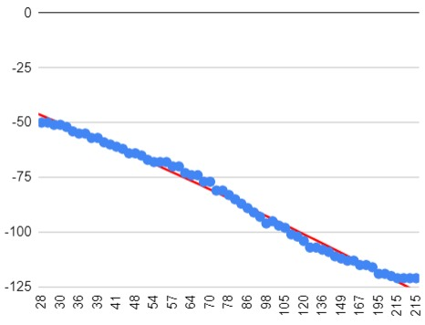

 XLNC Deoxys team's repository for WRO Future Engineers 2025
 
 Members: Dastan Musrepov, Zhanibek Danabek

 

***

# Contents

* [Mobility management](#mobility-management)
  * [Motor selection](#motor-selection)
  * [Chassis design](#chassis-design)
    * [Models](https://github.com/XLNC-Deoxys/WRO-FE25/tree/main/Models)
    * [Instruction](https://github.com/XLNC-Deoxys/WRO-FE25/tree/main/Instruction.pdf)
* [Power and sense management](#power-and-sense-management)
  * [Power management](#power-management)
    * [Schemes](https://github.com/XLNC-Deoxys/WRO-FE25/tree/main/Schemes)
  * [Sensor management](#sensor-management)
    * [Ultrasonic research](https://github.com/XLNC-Deoxys/WRO-FE25/blob/main/Ultrasonic_research/README.md) 
* [Engineering factor](#engineering-factor)
* [Obstacle management](#obstacle-management)
  * [Obstacle program exlanation](https://github.com/XLNC-Deoxys/WRO-FE25/blob/main/Source/Obstacle_Explanation.md)
  * [Open program exlanation](https://github.com/XLNC-Deoxys/WRO-FE25/blob/main/Source/Open_Explanation.md)
  * [Calibration program exlanation](https://github.com/XLNC-Deoxys/WRO-FE25/blob/main/Source/Calibration_Explanation.md)
  * [Pseudocode](https://github.com/XLNC-Deoxys/WRO-FE25/blob/main/Source/Pseudocode.py)
* [Performance video](#performance-video)
  * [Qualification](https://youtu.be/PEcvhSUIzB4?si=UgS1X2oOMbhzZKGW)
  * [Obstacle](https://youtu.be/IbS0yFTRe58?si=Fjd2noFWhd0FMp65)
* [Pictures](#pictures)
  * [Team photos](#team-photos)
  * [Robot photos](#robot-photos)

***

# Mobility Management

 

## Motor selection

### EV3 Motor Comparison

| Motor              | Nominal Speed (RPM) | Running Torque (N·cm) | Stall Torque (N·cm) | Mass (g) | Power Consumption (W) |
|-------------------|---------------------|------------------------|----------------------|----------|------------------------|
| EV3 Medium Motor  | 250                 | 8                      | 12                   | 75       | 2.5                    |
| EV3 Large Motor   | 160                 | 20                     | 40                   | 110      | 4.0                    |

We use a one **EV3 Medium Motor** for steering and two medium motors in the back for driving. We use medium motors because they are lighter, faster, more accurate and have enough torque.

### Robot Speed Estimation

**Parameters:**
- Gear ratio: 21:11 (increasing)
- Wheel diameter: 56 mm → Radius = 28 mm = 0.028 m
- Motor speed: 250 RPM (Medium Motor)
- Wheel circumference = 2 * π * R = 0.176 m

**Calculation:**
- Wheel RPM = 250 * (7/11) ≈ 159.1 RPM
- Robot linear speed = (Wheel RPM / 60) * Circumference ≈ **0.47 m/s**

## Chassis design

 

We installed all the motors vertically to make the robot smaller. Our brick is positioned with the battery forward to shift the center of gravity to the font wheels to increase treir grip. The steering motor works without gears for increased speed and precision. The width of our robot is 16 cm and the length of our robot is 15.9 cm, which allows us to park perpendicularly. Gears on the rear motors are 1:1 (excluding differential) and diameter of the wheels is 56 mm. Our robot is rear-wheel drive. This greatly simplifies the design and improves maintainability. We have a differential on the rear axle, which helps reduce the turning radius.
Last year we tried to use the Ackerman steering system ([photo above](https://github.com/RobotekPRIME2024/WRO-FE24/tree/main/Images/README_photos/Ackermann_steering_geometry.png)). The backlash was too big, we decided to abandon this mechanism this year. This allowed to increase the maximum rotation angle and simplify the design.
3D models of the robot made in BrickLink Studio 2.0 and Pixy2 mount are located in the [Models](https://github.com/XLNC-Deoxys/WRO-FE25/tree/main/Models) folder. Building instructions located in the [Instruction](https://github.com/XLNC-Deoxys/WRO-FE25/tree/main/Instruction.pdf) file.

 

***

# Power and sense management

## Power management

The power for the EV3 Brick and the whole vehicle comes from a rechargeable 10V Lithium Battery. It (with a brick) is placed closer to the front axle than to the rear to ensure good traction of the front wheels when cornering. Schemes for each electronic part of the robot can be found [here](https://github.com/XLNC-Deoxys/WRO-FE25/tree/main/Scheme.pdf).

## Sensor management

We use a color sensor to detect and determine the color of lines, a gyroscope to determine the angle of the robot, one ultrasonic sensor in the “obstacle” (clockwise or counterclockwise) or two in the “open” to determine the distance between the robot and the wall. We also use the Pixy2 Camera to detect and determine the color of road signs. On April 8, we made a graph of error versus angle. To determine the most accurate distance of the robot from the border, we conducted a research, which you can find in the [Researches](https://github.com/RobotekPRIME2024/WRO-FE24/tree/main/Ultrasonic_research). The ultrasonic sensor shows incorrect data if it is located at an angle. On April 8, we made a graph of error versus angle.

| Sensor |	Port	| Function	| Reason for selection |
|--------|------|----------|----------------------|
| Pixy2 |	1 |	Detect red/green obstacle	| Color+position-based path planning |
| Gyroscope |	2 |	Heading & turns	| Accurate angle tracking for PID |
| Color Sensor |	3	| Detect lines |	Reliable surface classification |
| Ultrasonic | 4	| Wall distance |	Enables centering in narrow passages |

***

# Engineering factor

We used components from the MINDSTORMS EV3 Core Set, Expansion Set, a Pixy2, some other technic pieces from other sets and 3D printed [case for Pixy](https://github.com/XLNC-Deoxys/WRO-FE25/tree/main/Models/Pixy2_case).
We use a new reinforced differential because it does not slip and can withstand any loads. We selected the diameter of the wheels so that the robot's design would be as simple as possible and the robot would be perpendicular to the ground. Our robot is made entirely of grey parts.
List of Lego EV3 sets we use in Bricklink can be found [here](https://www.bricklink.com/catalogList.asp?catType=S&catString=166.59.800)

***

# Obstacle management

## Avoiding obstacles using Pixy

First you need to configure Pixy2 to detect green and red pillars. Then you need to find the trajectory of the pillar using the Pixy2. To do this, we launch the robot so that it goes around the pillar and records its coordinates using the Pixy2. He takes the center of the pillar as the coordinates. After that, we transfer the data into a table and use the built-in tools in Google Sheets to find the equation. If the robot sees a pillar, it tries to follow that trajectory. If the pillar is red, then x of function are multiplied by 1, and if the pillar is green, then x of function are multiplied by -1 (inverse function). Our Pixy2 camera is at angle of 45 degrees so as not to lose the object too early and to detect it far enough away. If the robot does not see the pillar, it tries to bring the ultrasonic values ​​closer to 44 cm.

 

## Program overview
### Obstacle

The Obstacle2.bp program continuously gathers data from Pixy2, ultrasonic sensors, and the gyroscope. It uses the Pixy2 signature to determine if the object is green or red, and calculates a mirrored trajectory equation accordingly. The robot adjusts its path using these equations and follows the calculated curve while avoiding the obstacle. If no object is detected, it uses ultrasonic wall-centering to continue navigating safely.

#### Pseudocode

https://github.com/XLNC-Deoxys/WRO-FE25/blob/4a5e3cee411c91461a604e7479d26907a3826eb7/Source/Pseudocode.py#L1-L52

### Open
The Open2.bp program is used for the open challenge. The robot completes three laps while maintaining a balanced position between two side walls. It reads distances from left and right ultrasonic sensors and uses a gyro-based PID controller to steer straight. Color sensors detect orange turning points, which trigger a gyro reset and initiate a 90° turn. The robot dynamically selects direction based on detected color, completing the required path using modular and reactive logic.

The final robot program with explanation and pseudocode is located in the [Source](https://github.com/XLNC-Deoxys/WRO-FE24/tree/main/Source).

***

# Performance video

Here is the link to [qualification](https://youtu.be/PEcvhSUIzB4?si=UgS1X2oOMbhzZKGW) and [obstacle](https://youtu.be/IbS0yFTRe58?si=sEzfAh8LpjgD5ZdR) rounds demostration.

***

# Pictures
## Team photos

## Robot photos

  <table>
    <tr align="center">
      <td></td>
      <td></td>
      <td></td>
    </tr>
    <tr align="center">
      <td></td>
      <td></td>
      <td></td>
    </tr>
  </table>

  <li>You can see a photos of the robot <a href="https://github.com/XLNC-Deoxys/WRO-FE25/tree/main/Images/Robot_photos" target="_blank">here</a></li>
